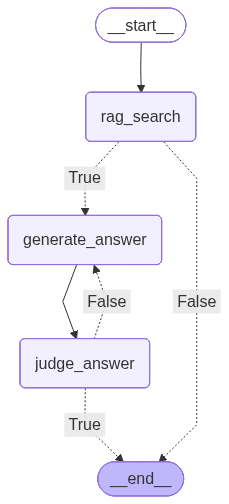

# True Flag Chatbot challenge

This is a project created in response to the exercise proposed by True Flag about a RAG agent for claim reviews.

The solution includes the ingestion of a csv file provided by true flag into a chroma database.

The agent will receive a query of a possible fake claim in the form of text or image (or both). With this query the agent will retrieve relevant documents from chroma database in order to determine if the claim is known to be false or not. In addition to retrieving the information, the agent will access the url associated with the document to find an updated version as well as a review in the language of the user if possible. Furthermore, a second "judge" llm will verify the answer is accurate and no hallucinations occurred when answering the user.



```
trueflag-challenge/
├── pyproject.toml              # Python project configuration and dependencies
├── README.md                   # This file - project overview and guide
├── decisions/                  # Collection of project decisions
├── notebooks/                  # Jupyter notebooks for data exploration
└── src/                        # Proposed solution
    ├──database.py              # Code relevant for indexing and querying the database
    ├──agents.py                # Agent definitions (judge and question answering)
    ├──nodes.py                 # Node and conditional edge definitions
    ├──prompts.py               # Collection of prompts used
    ├──graph.py                 # Definition of the graph connections
    ├──user-interface.py        # Main entry point for the solution

    └──config.py                # General configuration
```

# Execution
## Setup

The solution uses uv as the virtual environment manager. To initialize the environment, run:
```bash
uv sync
```

If you are going to run tests and/or notebooks, sync with the dev dependencies.

```bash
uv sync --dev
```

You need a .env file with the GEMINI_API_KEY variable set to a valid API key. Additionally, a hugging face token would allow for faster download of the CLIP model used for indexing (HF_TOKEN)

## Run ingestion

To ingest data from CSV into ChromaDB, run the following command:

```bash
uv run --env-file .env python -m src.database -i path/to/csv -o /path/toChroma
```

This process can take several minutes.

## Use Chatbot

The recommended usage of the chatbot is through the user interface:

```bash
uv run --env-file .env python -m src.user_interface -d path/to/chroma
```

The chatbot allows for queries on images and texts.
The chatbot does not have a memory system, therefore it will only take into consideration the last message for querying. The chat will show as a fluent conversation (History is not deleted with new queries)
